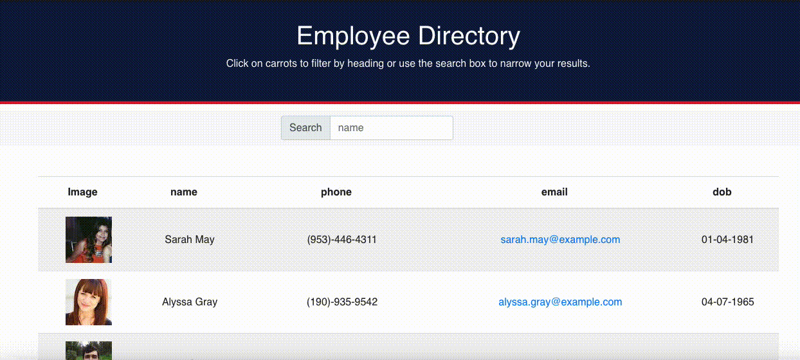

# React Employee Directory

## [Deployed Application](https://intense-ocean-22105.herokuapp.com/)

## Use 

## API used:
* randomuser.me 

## Overview

This project was an opportunity to dive into the React framework and use a new API that allowed me to explore state, using many components that are reusable.  

## User Story

* As a user, I want to be able to view my entire employee directory at once so that I have quick access to their information.

## Business Context

An employee or manager would benefit greatly from being able to view non-sensitive data about other employees. It would be particularly helpful to be able to filter employees by name.

## Challenges 
Had some issues deploying to heroku because I forgot a module.  